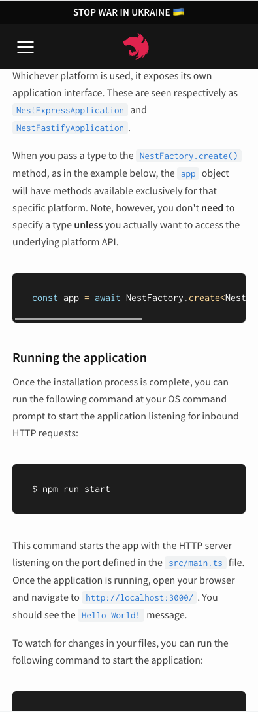
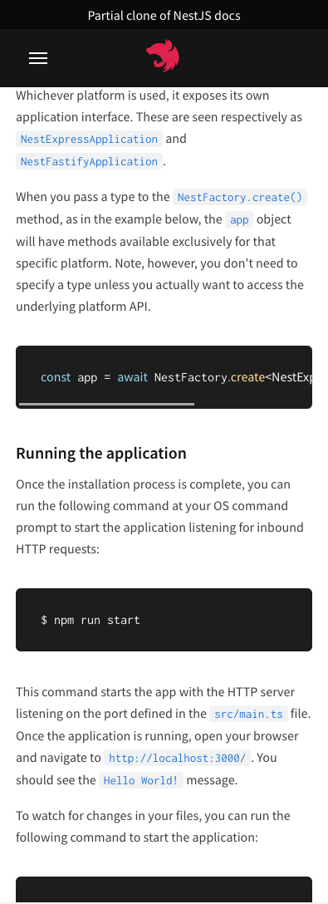

## freeCodeCamp challenge - Responsive Web Design Certification

### Build a technical Documentation Page

- I chose to clone part of nestJs documentation like with pixel precision
- Use of html and css only.
- Responsive Content
- Mobile and tablet navigation nav menu made without any JS

## Screenshot

### Original / Mine

 | 

## Author

- GitHub - [Carl Dev](https://github.com/TheNewDevl)